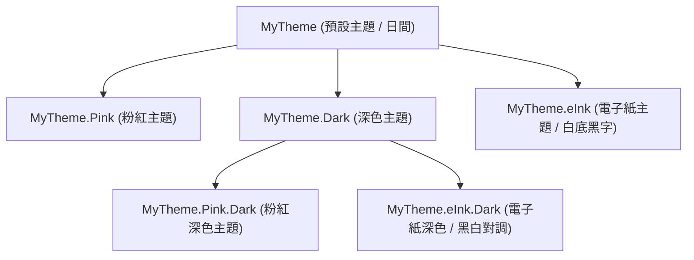

# Bahamut/theme - 主題系統與深色模式規範

**applyto**: `app/src/main/java/com/kota/Bahamut/pages/theme/**/*.kt`, `app/src/main/res/values*/**/*.xml`, `app/src/main/res/color*/**/*.xml`, `app/src/main/res/drawable*/**/*.xml`

## 📋 模組概述

theme 模組與 Android 原生樣式系統結合，提供應用程式的主題管理、自訂配色切換、系統深色模式（Dark Mode）適配，以及電子紙（E-Ink）專用高對比顯示。

專案採用 **Android 原生主題屬性 (Theme Attributes) + 資源限定符目錄 (values-night, color-night) + ThemeStore 資料模型** 三重架構，達成 UI 佈局與色彩完全解耦，確保在各種主題與深淺色切換時介面能即時、精準地自適應。

**技術棧**: Kotlin, Android Themes & Styles, DayNight Resource Qualifiers  
**設計模式**: 單例模式 (Singleton), 外觀模式 (Facade), 屬性抽象化  
**核心資源目錄**:
- `res/values/attrs.xml` - 自訂主題屬性宣告
- `res/values/styles.xml` - 各外觀主題樣式與屬性值配置
- `res/values/colors.xml` & `res/values-night/colors.xml` - 日間/夜間顏色定義
- `res/color/` & `res/color-night/` - 日間/夜間狀態文字色彩選擇器 (ColorStateList)

---

## 📂 核心類別

### 1️⃣ `Theme.kt` - 主題資料模型
定義主題物件的所有色彩屬性（以十六進位字串 `#AARRGGBB` 儲存）：
- 全域按鈕背景與文字色 (`backgroundColor`, `textColor`, `textColorDisabled`)
- 危險按鈕色彩 (`backgroundColorDanger`, `textColorDanger`)
- 文章閱讀內文與引用色彩 (`articleAuthorColor0/1`, `articleContentColor0/1`)
- 推文與作者色彩 (`articlePushAuthorColor`, `contentAuthorColor`)

### 2️⃣ `ThemeStore.kt` - 主題管理核心單例
負責主題的資料管理、持久化儲存與原生主題資源 ID 映射：

#### 主題索引與預設外觀
| Index | 外觀名稱 | 說明 |
|:---|:---|:---|
| **0** | **預設 (Default)** | 經典暗色底 + 灰階/彩色文字，日間標準樣式 |
| **1** | **粉紅 (Pink)** | 僅工具列與標籤按鈕呈現粉紅，其餘對齊預設樣式 |
| **2** | **深色 (Dark) / E-Ink** | 保留作為系統深色模式跟隨；在主題切換中為電子紙模式 |
| **4** | **粉紅深色 (PinkDark)** | 系統跟隨深色模式下的粉紅外觀 |
| **5** | **E-Ink 深色 (E-Ink Dark)** | 系統跟隨深色模式下的電子紙外觀（黑白對調） |

#### 重要方法
- `getSelectTheme()`: 根據目前選取的主題索引與深色模式狀態，回傳對應的 `Theme` 資料物件。
- `getThemeResId()`: 取得 Activity 應套用的原生主題資源 ID（`R.style.MyTheme`, `MyTheme_Pink`, `MyTheme_Dark`, `MyTheme_eInk`, `MyTheme_eInk_Dark`）。
- `getDialogThemeResId()`: 取得對話框 Activity（如 `DialogShortenImage`）應套用的主題資源 ID。
- `isSystemDarkMode(context)`: 判斷當前系統是否處於深色模式。

### 3️⃣ `ThemeManagerPage.kt` - 主題管理頁面
提供使用者切換預設、粉紅、電子紙等主題外觀的設定頁面。

### 4️⃣ `ThemeFunctions.kt` - 工具函式
提供主題色彩計算、按鈕狀態顏色產生等工具方法。

---

## 🎨 主題體系與樣式階層 (`styles.xml`)



### 1. `MyTheme`（預設主題）
- **頁面背景**: `@color/page_background`（預設 `#000000`）
- **文字顏色**: `bahamut_defaultTextColor` 為 `@color/white`
- **按鈕樣式**: 引用 `@color/button_text_color`（白色），工具列底色為深墨綠
- **標題列**: 暗藍底 (`#FF000060`)、黃標題 (`@color/yellow`)、白副標題
- **看板文章列表**: 狀態綠/青、編號橘、推文黃、作者紫等多色彩呈現

### 2. `MyTheme.Dark`（深色主題）
- **降亮度原則**: 深色模式下為避免刺眼，文字全面改為柔和灰白 `@color/gray_white` (`#FFE0E0E0`)
- **頁面底色**: `@color/dark_gray_10` (`#FF101010`)
- **按鈕文字**: 引用 `@color/button_text_color`（自適應讀取 `color-night` 轉為灰白字）
- **引用文章配色**: 調暗為柔和綠 `#FF60A060` (作者) 與 `#FF18A018` (內文)，消除高亮螢光綠刺眼感

### 3. `MyTheme.Pink` / `MyTheme.Pink.Dark`（粉紅主題）
- **設計準則**: **「僅按鈕與標籤套用粉紅，其他配色保持一致」**。
- 工具列按鈕（`ToolbarItem`）與標籤頁（`Tab`）選中時套用粉紅底色（`#FFFE00FE` / `#FF701850`）。
- 彈出對話框清單項目（表情符號、暫存檔）嚴格維持標準黑底白字，不被按鈕底色污染。

### 4. `MyTheme.eInk`（電子紙主題 - 日間）
- **設計準則**: **「純黑白高對比、不依賴彩色、按鈕狀態分明」**。
- **背景與文字**: 純白底 (`#FFFFFF`)、純黑字 (`#000000`)。
- **消除彩色**: 看板、信箱、分類列表中原本彩色的作者、推文、日期全數改為純黑或 `halfWhite` 灰階。
- **邊框與分隔線**: 所有對話框外框、分隔線均採用 1dp 純黑實線，對話框區塊為白底黑框。
- **按鈕狀態**: 純白底黑字，按壓反饋為深灰色（`#FF444444`）。

### 5. `MyTheme.eInk.Dark`（電子紙主題 - 深色模式）
- **設計準則**: **「黑白對調，灰階保持不變」**。
- **背景與文字**: 純黑底 (`#000000`)、純白字 (`#FFFFFF`)。
- **對調元素**: 標題列為黑底白字；對話框為純黑底 + 1dp 純白邊框；標籤頁選中為純白底黑字、未選中為純黑底白字。
- **保留元素**: 原有的灰階文字（`@color/halfWhite`、`#FF444444`）保持原樣不動。

---

## 🌙 深色模式 (Dark Mode) 運作機制

### 1. 跟隨深色模式設定
使用者可在「系統設定」頁面中開關「跟隨深色模式」：
- **開啟時**: App 依照系統的 DayNight 模式切換。
- **關閉時**: 強制鎖定日間主題，即使系統處於深色模式也不受影響。
- **底層實作** ([`ASNavigationController.kt`](file:///c:/git/bahamut-BBS-2/app/src/main/java/com/kota/asFramework/pageController/ASNavigationController.kt))：
  ```kotlin
  override fun attachBaseContext(newBase: Context) {
      UserSettings(newBase)
      if (!UserSettings.propertiesFollowSystemDarkMode) {
          val config = Configuration(newBase.resources.configuration)
          config.uiMode = (config.uiMode and Configuration.UI_MODE_NIGHT_MASK.inv()) or Configuration.UI_MODE_NIGHT_NO
          val context = newBase.createConfigurationContext(config)
          super.attachBaseContext(context)
      } else {
          super.attachBaseContext(newBase)
      }
  }
  ```

### 2. 運行中切換 vs 冷啟動自適應 (Resources Night)
因為 `AndroidManifest.xml` 中 `BahamutController` 宣告了 `android:configChanges="...|uiMode"`，使用者在系統下拉快捷開關切換深淺色時，Activity **不會被重建 (recreate)**。

為確保文字與介面顏色無論是在運作中即時切換或冷啟動進入時表現完全一致：
1. **按鈕與清單文字**：
   - 定義 `res/color/button_text_color.xml`（日間白色 `#FFFFFF`）。
   - 定義 `res/color-night/button_text_color.xml`（夜間柔和灰白 `#FFE0E0E0`）。
   - `styles.xml` 的 `MyTheme` 與 `MyTheme.Dark` 均統一參照 `@color/button_text_color`，由 Android 資源系統自動依 `uiMode` 無縫切換。
2. **顏色資源**：
   - 背景與控制項色彩均在 `res/values-night/colors.xml` 配置對應暗色值。
3. **動態讀取主題屬性**：
   - 程式碼中需取得主題色彩時，統一使用：
     ```kotlin
     val color = CommonFunctions.getThemeColor(R.attr.bahamut_xxx)
     ```
     禁止在程式碼中寫死數值或硬編碼。

---

## 📑 核心主題屬性一覽 (`attrs.xml`)

| 主題屬性 (Attribute) | 說明 | 典型用途 |
|:---|:---|:---|
| `bahamut_pageBackground` | 頁面底色 | 頁面根佈局底色（深灰 `#101010` / E-Ink 白 `#FFF` / E-Ink 深黑 `#000`） |
| `bahamut_defaultTextColor` | 通用預設文字顏色 | 提示文字、對話框內容、讀取中標籤 |
| `bahamut_buttonTextColor` | 主要按鈕與項目文字顏色 | 工具列按鈕、主選單項目、清單重要文字 |
| `bahamut_toolbarItemBackground` | 工具列按鈕背景 Drawable | 底部工具列按鈕（預設墨綠、粉紅、E-Ink 框線） |
| `bahamut_listDialogItemBackground` | 清單對話框項目背景 | 表情符號、暫存檔等選單項目（獨立解耦，黑底白字） |
| `bahamut_listDialogItemTextColor` | 清單對話框項目文字顏色 | 表情符號與選單項目文字 |
| `bahamut_dialogTitleBackground` | 對話框標題列底色 | 各彈出視窗頂部標題列 |
| `bahamut_dialogTitleTextColor` | 對話框標題列文字顏色 | 各彈出視窗頂部標題文字 |
| `bahamut_dialogBlockBackground` | 對話框分組區塊底色 | 引用設定、輸入群組的背景外框卡片 |
| `bahamut_dialogBorderColor` | 對話框外框邊線顏色 | 對話框 1dp 俐落外框線 |
| `bahamut_dividerColor` | 視圖分隔線顏色 | 列表項目間 1dp 分隔線 |
| `bahamut_tabSelectedBackground` | 選中標籤背景 | 書籤/歷史切換 Tab、訊息中心 Tab |
| `bahamut_tabUnselectedBackground`| 未選中標籤背景 | 未選中的標籤背景 |
| `bahamut_tabSelectedTextColor` | 選中標籤文字顏色 | 選中標籤文字（E-Ink 下黑字，其餘白字） |
| `bahamut_tabUnselectedTextColor` | 未選中標籤文字顏色 | 未選中標籤文字 |
| `bahamut_articleAuthorColor1` | 引用文章作者標頭顏色 | 閱讀頁中「xxx 說:」引言作者標頭（深色調暗為 `#60A060`） |
| `bahamut_articleContentColor1` | 引用文章內容文字顏色 | 閱讀頁中引言內文（深色調暗為 `#18A018`） |
| `bahamut_checkboxTint` | 核取方塊與單選鈕顏色 | 對話框內單選/多選圓點（E-Ink 純黑/純白） |

---

## ⚠️ 開發規範與注意事項

1. **嚴禁寫死顏色常數**：
   - ❌ 錯誤：`textView.setTextColor(-1)`、`view.setBackgroundColor(Color.WHITE)`
   - ✅ 正確：`textView.setTextColor(CommonFunctions.getThemeColor(R.attr.bahamut_defaultTextColor))` 或在 XML 中設定 `android:textColor="?attr/bahamut_defaultTextColor"`
2. **元件樣式嚴格解耦**：
   - 新增列表或對話框項目時，務必使用專屬屬性（如 `bahamut_listDialogItemBackground`），切勿直接套用通用按鈕屬性，避免未來微調通用按鈕時產生非預期的色彩污染。
3. **保持 E-Ink 主題的純粹性**：
   - 調整 Default 或 Pink 主題時，**切勿更動 `MyTheme.eInk` 與 `MyTheme.eInk.Dark` 的設定**。
   - E-Ink 模式不得出現任何彩色元素（綠色、黃色、粉色等），所有標籤必須為純黑、純白或乾淨灰階。
4. **維持 Telnet 原生 ANSI 畫面**：
   - BBS 連線終端畫面（`TelnetView`）必須維持原生 ANSI 色碼，**不可**強行轉為主題色，以維持 BBS 原生閱讀體驗。

