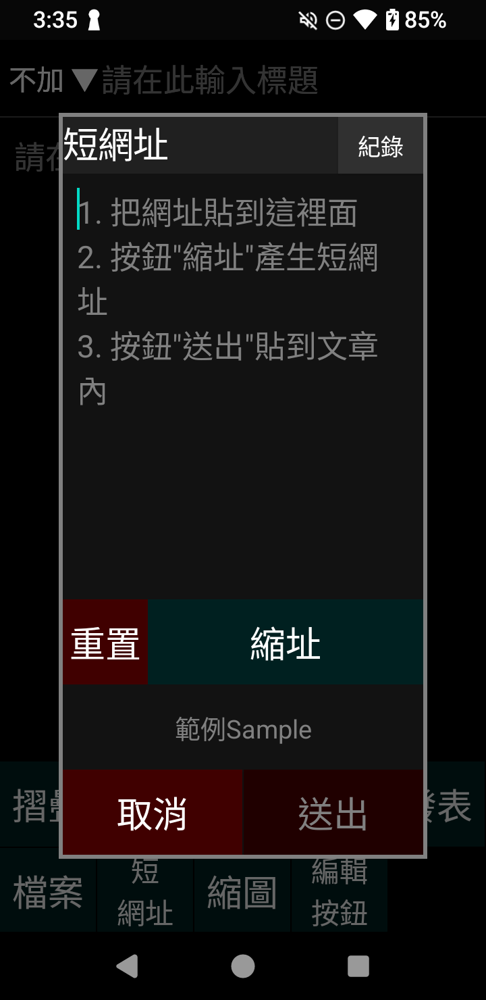
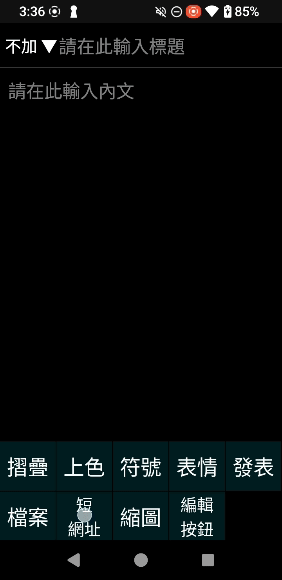

# 短網址
## 操作
* 發文頁面，下方工具列可呼叫出發文工具
* 「短網址」進入短網址產生頁面

* 把網址貼到上方框裡面
* 按鈕「縮址」產生短網址
* 按鈕「送出」貼到文章內
## 方便操作
* 進入頁面會自動擷取剪貼簿內容，並擷取出連結文字。方便自己再做後續處理去掉個人廣告資訊
* 按鈕「紀錄」查詢之前送出過的短網址
## 注意
* 每小時上限200次轉址(全部用戶共享)
## 示範影片
